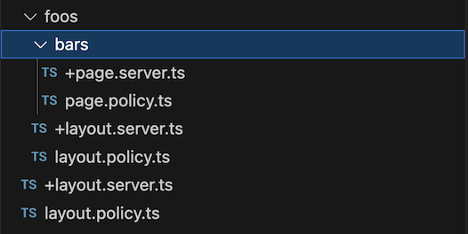

# CanIKit

The missing SvelteKit Authorization Library!

CanIKit is a SvelteKit library that provides a simple way to add authorization to your SvelteKit application. It is heavily inspired by [Pundit](https://github.com/varvet/pundit);

The main purpose of CanIKit is to provide a simple way to isolate server-side authorization logic from your route files. This allows for a better separation of concerns and helps keep your +server, +layout.server, and +page.server files cleaner.

Another key feature of CanIKit is that an error is thrown if the `canI` method is not called when running server-side code (typically server page loads or API calls). This helps ensure that authorization is always considered when designing your routes.

## Installation

```sh
npm install canikit
```

## Setup

### Add the hook
CanIKit provides a `hook` that must be set up in your hooks.server file.

```typescript
// hooks.server.ts
import { canIKitHandle } from "canikit";

// ...

export const handle = canIKitHandle;
```

In the likely event that you are already using a hook, simply utilize the SvelteKit `sequence` function to combine the hooks.

```typescript
// hooks.server.ts
import { canIKitHandle } from "canikit";
import { sequence } from "@sveltejs/kit/hooks";

// ...

export const handle = sequence(
  // ... other hooks,
  canIKitHandle
);
```

### Add the vite plugin
In order to verify that the `canI` method is called, CanIKit provides a vite plugin that must be added to your vite config.

```typescript
// vite.config.ts
import { sveltekit } from "@sveltejs/kit/vite";
import { canIKitPlugin } from "canikit";

export default defineConfig({
  // ... other config
  plugins: [
    sveltekit(),
    canIKitPlugin()
  ],
});
```


## Usage

Once setup, you will likely start getting some errors when you try to load your pages. This is because on every server-side load event, CanIKit will check to ensure that the `canI` method is called. Let's see an example of how we can do that.

```typescript
// +page.server.js
export async function load({ request, locals: { canI } }) {
  const user = ... // Find the user based on the request
  await canI({ user });


  // ... other code
}
```

In it's most basic form, the `canI` function can be passed a user object. The user will be passed to the policy for the page, layout, or API route. Let's see an example of a policy file for a page:

In the same directory as the `+page.server.js|ts` file, create a `page.policy.js|ts` file.

This very simple policy just checks to ensure that we have a signed in user, otherwise the authorization will fail.

```typescript
// page.policy.ts
export async function view({ user }) {
  if (!user) return false;
  return true;
}
```

Or, if you prefer to use a policy class instead:

```typescript
// page.policy.ts
import { CanIKitPolicy } from "canikit";
export default class Policy extends CanIKitPolicy {
  async view() {
    // We have access to this user object through this.user
    if (!this.user) return false;

    return true;
  }
}
```

### Authorizing resources

Often, 'who can view this page' is not enough. We often need to authorize the page (or action) against a specific resource. Take this page for example

`./routes/todos/[id]/+page.server.ts`

In this case, we only want to allow the user to view the page if they are the owner of the todo item. We can do this by passing the resource to the `canI` method.

```typescript
// +page.server.ts
export async function load({ request, params, locals: { canI } }) {
  const user = ... // Find the user based on the request
  const todo = ... // Find the todo based on the params
  await canI({ user, resource: todo });

  // ... other code
}

```

Then, inside our policy file:

```typescript
// page.policy.ts
export async function view({ user, resource }) {
  // We have access to this user object through this.user
  // We have access to the resource through this.resource
  if (!user) return false;

  // We only want to allow the user to view the page if they are the owner of the todo item
  if (user.id !== resource.userId) return false;

  return true;
}
```

Or, for a class policy:

```typescript
// page.policy.ts
import { CanIKitPolicy } from "canikit";
export default class Policy extends CanIKitPolicy {
  async view() {
    // We have access to this user object through this.user
    // We have access to the resource through this.resource
    if (!this.user) return false;

    // We only want to allow the user to view the page if they are the owner of the todo item
    if (this.user.id !== this.resource.userId) return false;

    return true;
  }
}
```

### Authorizing actions

So far, we've only added 'view' actions to our policy. This is the default action that is called when the request is a GET request, such as when loading a page. When we're doing _POST_, _PUT_, OR _DELETE_ requests, the action will be _'create'_, _'update'_, and _'delete'_ respectively.

You can override the default action by passing it as an option to the `canI` method.

```typescript
// +page.server.ts
export async function load({ request, params, locals: { canI } }) {
  const user = ... // Find the user based on the request
  const todo = ... // Find the todo based on the params
  await canI({ user, resource: todo, action: "update" });

  // ... other code
}
```

### Handling authorization errors

You should always handle authorization errors. There are two main ways to do this.

The first is to add a `permissionDenied` function to your relevant policy file. This function will be called when the authorization of that policy fails. For example:

```typescript
import { error } from "@sveltejs/kit";
export async function permissionDenied({ user, resource, action, event }) {
  throw error(403, "Permission denied");
}
```

Or, you might want to redirect the user to a different page:

```typescript
import { redirect } from "@sveltejs/kit";
export async function permissionDenied({ user, resource, action, event }) {
  return redirect("/login");
}
```

Or in a class policy:

```typescript
import { CanIKitPolicy } from "canikit";
import { redirect } from "@sveltejs/kit";
export default class Policy extends CanIKitPolicy {
  async permissionDenied() {
    return redirect("/login");
  }
}
```

The second way is to catch the error when you call `canI`:

```typescript
// +page.server.ts
export async function load({ request, params, locals: { canI } }) {
  const user = ... // Find the user based on the request
  const todo = ... // Find the todo based on the params
  try {
    await canI({ user, resource: todo, action: "update" });
  } catch (e) {
    if(e.name == 'PermissionDeniedError') {
      return redirect("/login");
    } else {
      throw e;
    }
  }

  // ... other code
}
```

You should ensure that you deal with the authorization error in every case, otherwise a 500 error will be thrown.

### Custom actions

Feel free to add your own custom actions. For example, you may want to add a 'complete' action to the todo item policy.

### Understanding policy load order

There are a few rules to keep in when designing your policies:

- CanIKit expects a policy file to be in the same directory as the server file. For example, if you have a `+page.server.ts` file, CanIKit will look for a `page.policy.ts` file in the same directory. If you have a `+layout.server.ts` file, CanIKit will look for a `layout.policy.ts` file in the same directory and if you have a `+server.ts` file, CanIKit will look for a `policy.ts` file in the same directory.

- You must have a policy file for each server file unless you skip authorization in the server file.

- When you render a page, all of the layout policies which are _ancestors_ to the page will be called first, with the page policy being called last.

For example:



In this case, when the bars page is rendered, the root layout policy will be called first, then the foos layout policy, then the bars layout policy (if it exists), and finally the bars page policy.

**All policies must pass for the page to be rendered.**

**IMPORTANT:** It is strongly recommended that you do not call `canI` from layout files. Always call `canI` from the page or API route file. It's great to add a layout policy to nest specific checks, but calling `canI` from the layout file will open up the risk of accidently skipping authorization in the page file. In this case, there missing authorization error will not be thrown.

### Skipping authorization

Sometimes, you may want to skip authorization for a page. For example, you may have a public page that anyone can view. You can do this by calling the skipCanI method.

```typescript
// +page.server.ts
export async function load({ request, params, locals: { skipCanI } }) {
  skipCanI();

  // ... other code
}
```

### Using custom policies

You can pass a different policy to the `canI` method if you want to use a custom or different policy. For example, you may want to use a different policy for a specific page.

```typescript
const MyOtherPolicy = ... // Import your custom policy
export async function load({ request, params, locals: { canI } }) {
  const user = ... // Find the user based on the request
  const todo = ... // Find the todo based on the params
  await canI({ user, resource: todo, policy: MyOtherPolicy });

  // ... other code
}
```

**Note:** Ancestor layout policies will still be called before the custom policy.

### Using policies outside of the load/get/post/put/delete functions:

Sometimes, you may want to use the policy outside of the load/get/post/put/delete functions. You can do this by importing the policy directly.

```typescript
import { view } from "./page.policy";

async function someFunction({ user, resource }) {
  const canView = await view({ user, resource });
}
```

Or, for class policies:

```typescript
import Policy from "./page.policy";

async function someFunction({ user, resource }) {
  const policy = new Policy({ user, resource });
  const canView = await policy.view();
}
```
